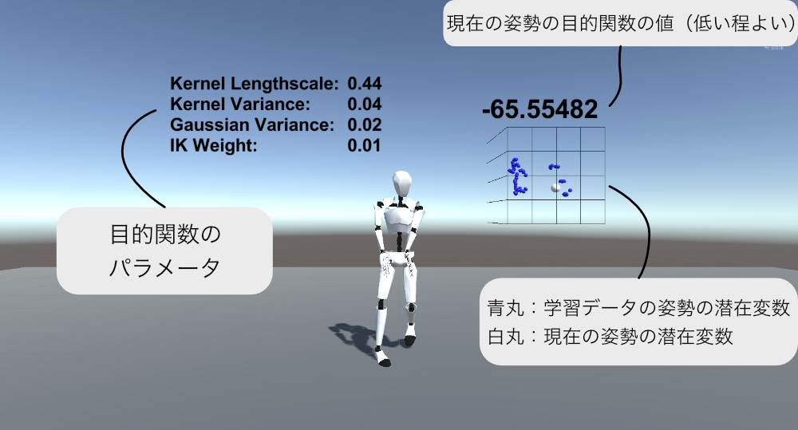

# Style-based VRIK

## What is this?
Unityで、手先のコントローラから全身のアバターの姿勢を生成するためのシステムです。  
その姿勢の生成のためにScaled GPLVMという機械学習の手法を用いているのが特徴です。

このシステムを使うと、以下のような（なんとも微妙な）動きを生成することができます。


## システム構成
このシステムは大きく3つのディレクトリに分けられます

1. learn        ->  pythonを用いてモデルの学習を行う
2. Plugins      ->  学習済みモデルを読み込んでリアルタイムに姿勢の最適化を行うUnityのプラグイン
3. unity        ->  最終的なアバターの姿勢をビジュアライズするためのUnityプロジェクト

次からはunityでの学習済みのモデルを用いた実行の方法について説明します。  
pythonでの学習については ```./learn/README.md``` を、Unityのプラグインのビルドなどについては ```./Plugin/README.md``` を参照してください。

## Unityでの実行方法
1. Unity 2018.2.14f1 をインストール。最新版のUnityだと多分プラグインが動作しません  
2. Oculusを接続
3. ```./unity```ディレクトリをUnity Projectとして読み込む
4. main.unity を開く 
5. 再生ボタンを押して実行 

## 画面説明
実行すると、アバターとともにいくつかの数字などが表示されます。  
それぞれの数字の意味は以下の通りです。  


この状態でコントローラを動かすと、その位置に応じてアバターの姿勢も変化しますが、デバッグのためにコントローラのボタンを介しても操作をすることができます。

|入力|説明|
|:---|:---|
|Xボタン|通常⇆潜在変数モード 切り替え|
| 左スティック(潜在変数モード中) | 潜在変数をXY平面上で動かす |  
| 人差し指トリガー(潜在変数モード中) | 潜在変数をZ軸+方向に動かす |  
| 中指トリガー(潜在変数モード中) | 潜在変数をZ軸-方向に動かす |  
| 左スティック押込(潜在変数モード中) | 潜在変数を原点に戻す |  
| 右スティック　左右 | IK Weight 上昇 減少 |
| 人差し指トリガー　+ 右スティック　左右 | Kernel Variance 上昇 減少 |
| 中指トリガー + 右スティック　左右 | Kernel Lengthscale 上昇 減少 |
| 人差し指トリガー　+ 中指トリガー + 右スティック　左右 | Gaussian Variance 上昇 減少 |

<!-- ## License
Copyright © 2019, Arihide Takahashi. Released under the GPL License. -->